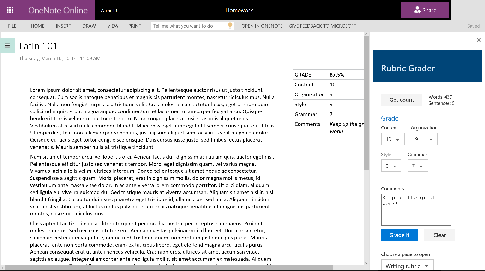
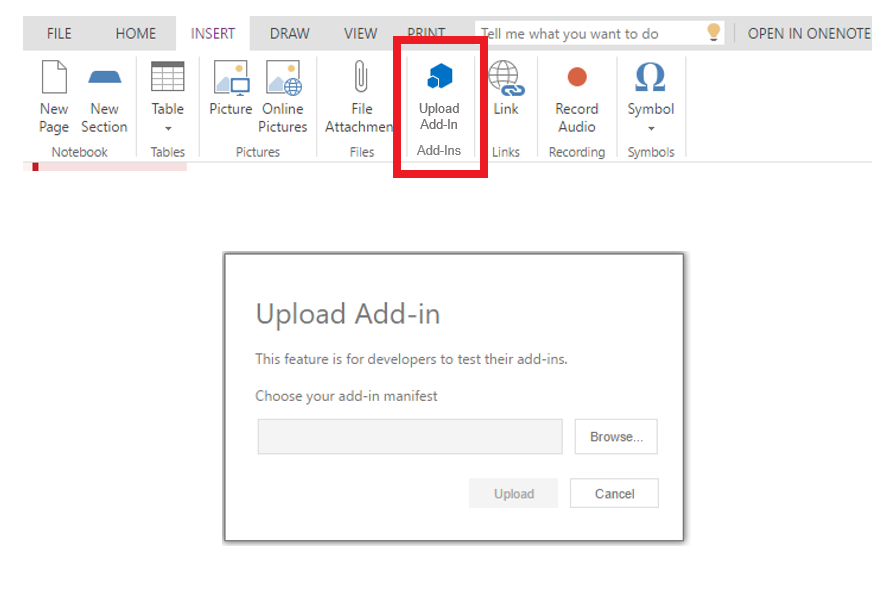

# Rubric Grader Task Pane Add-in for OneNote Online (Preview)

_Applies to: OneNote Online_

The Rubric Grader sample shows you how to use the OneNote JavaScript API (in Preview) in a OneNote task pane add-in. The add-in gets page content, adds an outline to the page, and opens a different page.

The add-in helps teachers to grade writing assignments based on a grading rubric.

 

## Prerequisites
- A test notebook from the OneNote team. See [Getting started with OneNote add-ins (Preview)] for more information about developing OneNote add-ins during the initial, limited preview period.

- Git. Install it from [https://git-scm.com/download](https://git-scm.com/download).

- Node.js. Install it from [https://nodejs.org](https://nodejs.org).

- Yeoman Office Add-in generator. To install the generator and its prerequisites, follow the [installation instructions](https://code.visualstudio.com/Docs/runtimes/office).

### Using the Office Add-in Generator 
The Office Add-in Generator makes it easy to create add-in projects when you don't have Visual Studio installed, or want to use technologies other than plain HTML, CSS, and JavaScript. It also provides quick access to a Gulp static server for testing. 
 
>You need the Office Add-in Generator to follow the instructions in this article. However, you can download the sample and host the contents of the **app** folder on any website. Update the manifest file by pointing **SourceLocation** to the **grader.html** file on your website.

## Download the sample
1. Clone or download the [OneNote-Add-in-Rubric-Grader-Preview](https://github.com/OfficeDev/oneNote-Add-in-Rubric-Grader-Preview) repository. 

   The Office Add-in Generator creates a lot of supporting files for add-in projects. Most of these files aren't stored in the sample repository on GitHub, so you'll generate a local project and then overwrite some local files with files from the sample. 

## Create and configure the add-in project 
1. Create a local folder named *onenote-add-in*.

2. Open a **cmd** prompt and navigate to the **onenote-add-in** folder. Run the `yo office` command, as shown below.

   ```
C:\your-local-path\onenote-add-in\> yo office
   ```

3. Use the following options to create the project.

   | Option | Value |
   |:------|:------|
   | Project name | OneNote Add-in |
   | Root folder of project | (accept the default) |
   | Office project type | Task Pane Add-in |
   | Supported Office applications | (choose any--we'll add a OneNote host later) |
   | Technology to use | HTML, CSS & JavaScript |

4. After the new project is created, delete the **app** folder that was created in the project files.

5. Copy the **app** folder from the sample files into your **onenote-add-in** folder to replace the one you just deleted.

6. Open **manifest-onenote-add-in.xml** in your project files using any text editor.

   a. Add the following line to the **Hosts** section.

   ```xml
<Host Name="Notebook" />
   ```

   b. In the **DefaultSettings** section, change the **SourceLocation** element from  `home.html` to `grader.html`, as shown below.

   ```xml
<SourceLocation DefaultValue="https://localhost:8443/app/home/grader.html"/>
   ```

## Run the add-in 
1. Open a **cmd** prompt and navigate to the **onenote-add-in** folder. Run the `gulp serve-static` command, as shown below.

   ```
C:\your-local-path\onenote-add-in\> gulp serve-static
   ```

   You'll need to trust the self-signed certificates that are included with the web server so you don't get warnings from the browser.

2. In OneNote Online, open the notebook that the OneNote team created for you. Create a couple pages in the current section. On one page, add a paragraph of content.

   The sample expects all page content to be in one outline. You can click your content in the OneNote page to display the outline border and verify that your content is in one outline.

3. Choose **Insert > Upload Add-in**. 

   

4. In the **Upload Add-in** dialog, browse to **manifest-onenote-add-in.xml** in your project files, and then choose **Upload**.

5. The add-in opens in an iFrame next to the OneNote page. You can:
   - Use the **Get stats** button to get approximate word and sentence counts. 
   - Enter scores and a comment, and then choose **Grade it** to add the grade to the page.
   - Choose **Open page** to open the page that's selected in the dropdown.

### Troubleshooting and tips 
- You can debug the add-in using your browser's developer tools. When you're using the Gulp static server and debugging in Internet Explorer or Chrome, you can save your changes locally and then just refresh the add-in's iFrame.

- When you inspect a OneNote object, the properties that are currently available for use display actual values. Properties that need to be loaded display *undefined*. Expand the `_proto_` node to see properties that are defined on the object but are not yet loaded.

      

- You need to enable mixed content in the browser if your add-in uses any HTTP resources. Production add-ins should use only secure HTTPS resources.

## Learn more

- [Office Add-ins](https://msdn.microsoft.com/library/office/jj220082.aspx)
