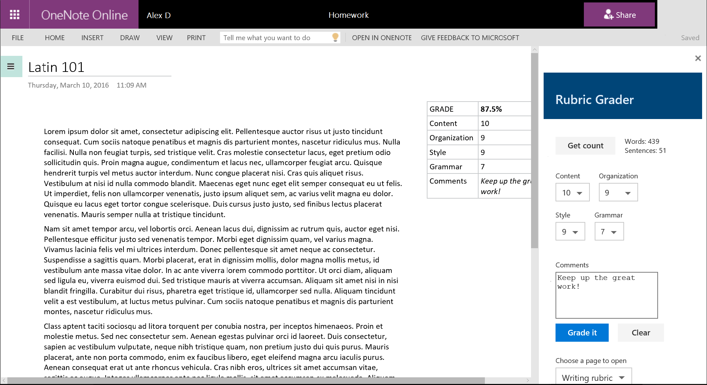

# Rubric Grader Task Pane Add-in for OneNote Online (Preview)

_Applies to: OneNote Online_

The Rubric Grader sample shows you how to use the OneNote JavaScript API (in Preview) in a OneNote task pane add-in. The add-in gets page content, adds an outline to the page, and opens a different page.

The add-in helps teachers to grade writing assignments based on a grading rubric.

 

## Prerequisites
- A test notebook from the OneNote team. See ///topic link currently not known/// for more information about developing OneNote add-ins during the initial preview period.

- Microsoft Office Project Generator (Office Generator) and its prerequisites ([Node.js](https://nodejs.org), [npm](https://www.npmjs.com/), [Bower](http://bower.io/)). Installation instructions are in [this article](https://dev.office.com/blogs/creating-office-add-ins-with-any-editor-introducing-yo-office). 

   >You'll need the Office Generator to follow the instructions in this article, but you can download the project and host your website however you'd like. Learn more [here](#self-host).

## Office Generator
Using Office Generator makes it easy to create add-in projects when you don't have Visual Studio installed, or when you want quick access to a Gulp static server for testing. 
 
Office Generator creates a lot of files for add-in projects. Most of these files aren't stored in the sample repository on GitHub, so you'll generate a local project and then overwrite some local files with sample files. 

### Download the sample
1. Clone or download the [OneNote-Add-in-Rubric-Grader-Preview](https://github.com/OfficeDev/oneNote-Add-in-Rubric-Grader-Preview) repo. 

### Create and configure the add-in project 
1. Create a local folder named *onenote-add-in*.

2. Open a **cmd** prompt and navigate to the **onenote-add-in** folder. Run the `yo office` command, as shown below.

   ```
C:\<local path>\onenote-add-in\> yo office
   ```

3. Use the following options to create the project.

   | Option | Value |
   |:------|:------|
   | Project name | OneNote Add-in |
   | Office project type | Task Pane Add-in |
   | Technology to use | HTML, CSS & JavaScript |
   | Supported Office applications | Any Office product (we'll add a OneNote host later) |

   

4. Open manifest-onenote-add-in.xml from your project files using any text editor.
   a. Add the following line to the **Hosts** section.

   ```xml
<Host Name="Notebook">
   ```

   b. In the **DefaultSettings** section, change the **SourceLocation** element from  `.../home/home.html` to `.../home/grader.html`, as follows.

   ```xml
<SourceLocation DefaultValue="https://localhost:8443/app/home/grader.html"/>
   ```

5. After the project is created, rename or delete the **app** folder.

6. Copy the **app** folder from the sample files into your **onenote-add-in** folder.

### Test and run the add-in 
1. Open a **cmd** prompt and navigate to the **onenote-add-in** folder. Run the `gulp serve-static` command, as shown below.

   ```
C:\<local path>\onenote-add-in\> gulp serve-static
   ```

   You'll need to trust the self-signed certificates that are included with the web server so the browser won't give you any warnings.

2. Create a couple pages in the current section. On one page, add a paragraph of content.

   >This sample expects the page content to be in one outline. You can click on your content in the OneNote page to display the border of the outline.

3. Open the OneNote Online notebook that the OneNote team created for you. Choose **Insert > Upload Add-in**. 

   

4. Choose manifest-onenote-add-in.xml in your project files, and then choose **Upload**. While testing, the manifest file can be stored locally.

5. The add-in opens in an iFrame next to the OneNote page. 
   - Use the **Get stats** button to get approximate word and sentence counts. 
   - Enter scores and a comment, and then choose **Grade it** to add the grade to the page.
   - Choose **Open page** to open the page that's selected in the dropdown.

#### Tips 
- You can debug the add-in using your browser's developer tools. When you're using the Gulp static server and debugging in Internet Explorer or Chrome, you can save your changes locally and then just refresh the add-in's iFrame.
- When you inspect a OneNote object, the properties that are currently available for use display actual values. Properties that need to be loaded display *undefined*. Expand the **_proto_** node to see properties that are defined on the object but not yet loaded.
- You need to enable mixed content in the browser if your add-in uses any HTTP resources. Production add-ins should use only secure HTTPS resources.

## Learn more
<onenote links to come>
- 
