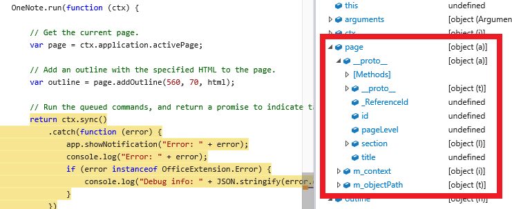

# Rubric Grader Task Pane Add-in for OneNote Online (Preview)

_Applies to: OneNote Online_

The Rubric Grader sample shows you how to use the OneNote JavaScript API (in Preview) in a OneNote task pane add-in. The add-in gets page content, adds an outline to the page, and opens a different page.

The add-in helps teachers to grade writing assignments based on a grading rubric.

 

## Prerequisites
- A test notebook from the OneNote team. See [OneNote add-ins JavaScript programming overview (Preview)](http://aka.ms/onenote-add-ins) for more information about developing OneNote add-ins during this initial, limited preview period.

- Yeoman Office generator. To install the generator and its prerequisites, follow these [installation instructions](https://dev.office.com/docs/add-ins/get-started/create-an-office-add-in-using-any-editor). After you install the Yeoman Office generator using the npm command, return to this article. 

   The Yeoman Office generator makes it easy to create add-in projects when you don't have Visual Studio or you want to use technologies other than plain HTML, CSS, and JavaScript. It also provides quick access to a local Gulp web server for testing. 

   >You can optionally [use Visual Studio](https://dev.office.com/docs/add-ins/get-started/create-and-debug-office-add-ins-in-visual-studio) to create your project files, and then host the contents of the **app** folder on any HTTPS website. Skip Step 2 below, and point the **SourceLocation** in the manifest to **grader.html** on your website in Step 3.

## Step 1: Download the sample
1. Clone or download the [OneNote-Add-in-Rubric-Grader-Preview](https://github.com/OfficeDev/oneNote-Add-in-Rubric-Grader-Preview) repository. 

   The Office Add-in Generator creates a lot of supporting files for add-in projects. Most of these files aren't stored in the repository, so you'll generate a local project and then overwrite some local files with sample files. 

## Step 2: Create the add-in project and set up the test server
1. Create a local folder named *onenote add-in*.

2. Open a **cmd** prompt and navigate to the **onenote add-in** folder. Run the `yo office` command, as shown below.

   ```
C:\your-local-path\onenote add-in\> yo office
   ```
   >These instructions use the Windows command prompt but are equally applicable for other shell environments. 

3. Use the following options to create the project.

   | Option | Value |
   |:------|:------|
   | Project name | OneNote Add-in |
   | Root folder of project | (accept the default) |
   | Office project type | Task Pane Add-in |
   | Supported Office applications | (choose any--we'll add a OneNote host later) |
   | Technology to use | HTML, CSS & JavaScript |

   It takes a few minutes to create the project and add all the supporting files.

4. After the project is created, run `gulp serve-static` in the **cmd** prompt, as shown below. This will start the Gulp web server.

   ```
C:\your-local-path\onenote add-in\> gulp serve-static
   ```
   The server is available when you see the `Finished 'serve-static' ...` entry in the window. Keep this window open while you're running the add-in.

5. Install the Gulp web server's self-signed certificate as a trusted certificate. You only need to do this one time on your computer for add-in projects created with the Yeoman Office generator.  

   a. In a browser, navigate to the hosted add-in page. By default, this is the same URL that's in your manifest:

   ```
https://localhost:8443/app/home/home.html
   ```

   b. Install the certificate as a trusted certificate. For more information, see [Adding Self-Signed Certificates as Trusted Root Certificate](https://github.com/OfficeDev/generator-office/blob/master/docs/trust-self-signed-cert.md).

## Step 3: Configure the add-in project 
1. Open the **onenote add-in** folder that you created, and delete the **app** folder from the project files.

2. Copy the **app** folder from the sample files into your **onenote add-in** folder to replace the one you just deleted.

3. Open **manifest-onenote-add-in.xml** in the **onenote add-in** folder.

   a. Add the following line to the **Hosts** section. This specifies that your add-in supports the OneNote host application.

   ```
<Host Name="Notebook" />
   ```

   b. In the **DefaultSettings** section, change the **SourceLocation** element from  `home.html` to `grader.html`, as shown below.

   ```
<SourceLocation DefaultValue="https://localhost:8443/app/home/grader.html"/>
   ```

## Step 4: Run the add-in 
1. In OneNote Online, open the notebook that the OneNote team created for you. Create a couple of pages in the current section. On one page, add a paragraph of content.

   >If this is the first time you've opened OneNote Online, you may need to refresh the page to see your default notebook.

2. Choose **Insert > Upload Add-in**. 

   

3. In the **Upload Add-in** dialog, browse to the **manifest-onenote-add-in.xml** file that you modified in your project files, and then choose **Upload**.

4. The add-in opens in an iFrame next to the OneNote page. You can:
   - Use the **Get count** button to get approximate word and sentence counts. 
   - Set scores in the scoring dropdowns, enter a comment, and then choose **Grade it** to add the grade to the page.
   - Choose **Open page** to open the page that's selected in the dropdown.

### Troubleshooting and tips 
- You can debug the add-in using your browser's developer tools. When you're using the Gulp web server and debugging in Internet Explorer or Chrome, you can save your changes locally and then just refresh the add-in's iFrame.

- When you inspect a OneNote object, the properties that are currently available for use display actual values. Properties that need to be loaded display *undefined*. Expand the `_proto_` node to see properties that are defined on the object but are not yet loaded.

      

- You need to enable mixed content in the browser if your add-in uses any HTTP resources. Production add-ins should use only secure HTTPS resources.

## Learn more

- [OneNote add-ins JavaScript programming overview (Preview)](http://aka.ms/onenote-add-ins)
- [Office Add-ins](https://dev.office.com/docs/add-ins/overview/office-add-ins)
